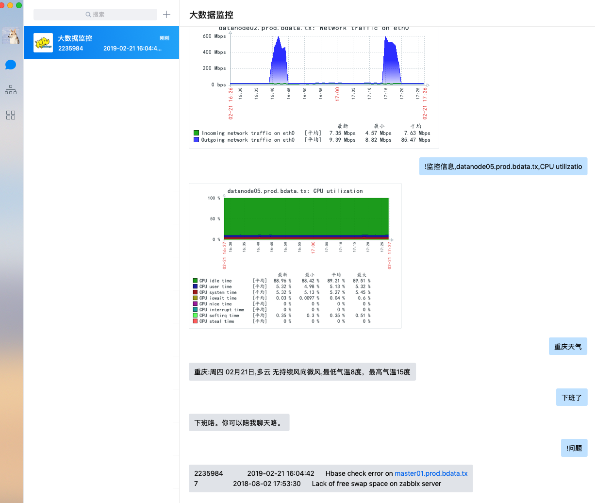

# 企业微信报警（问答模式）
## 说明：
项目比较简单，自己用在监控中，平时没事可以和机器人聊聊天。
## 功能说明：
* 1.企业微信报警
* 2.聊天机器人（图灵机器人）
* 3.企业微信接入zabbix api，支持应答模式

[](#)
## 安装说明：
环境：python3
系统：linux
企业微信平台（https://work.weixin.qq.com）需要自建应用并开启接收消息API，获取Token， EncodingAESKey等信息
图灵机器人的key也需要个人申请哈
### qyweixin项目安装说明：
```bash
pip3 install -r requirements.txt
python3 main.py
```
